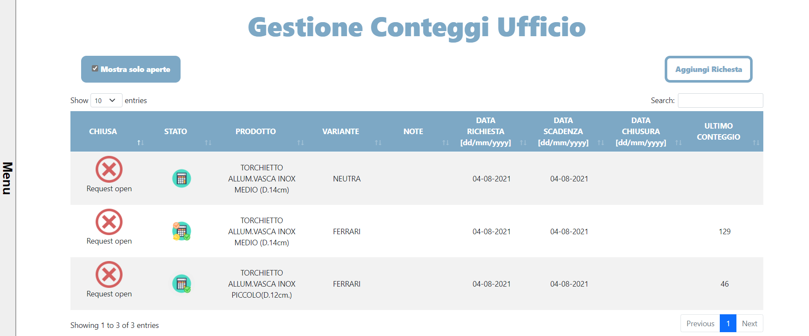
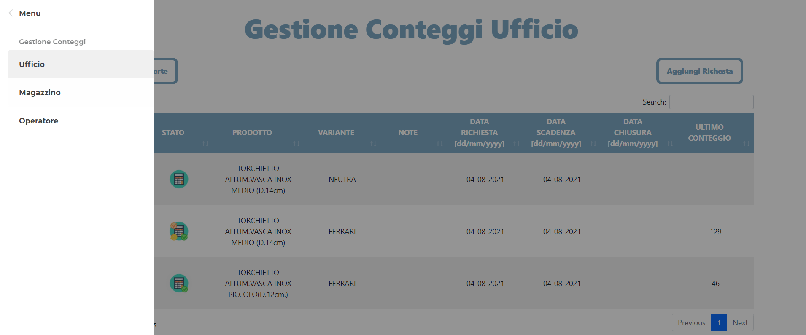
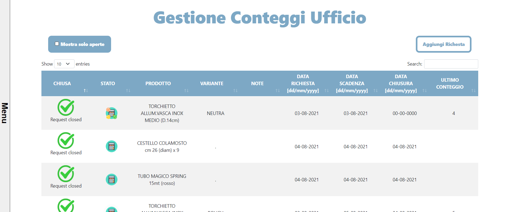
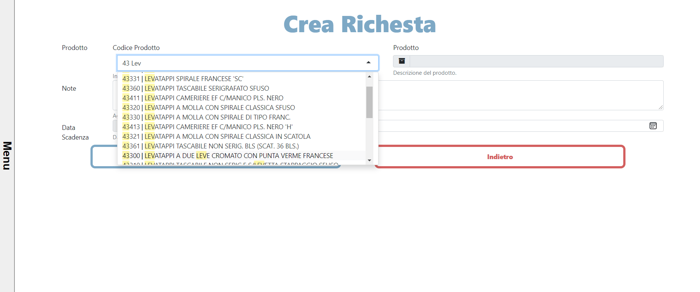
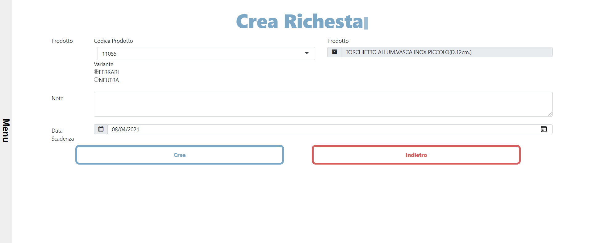
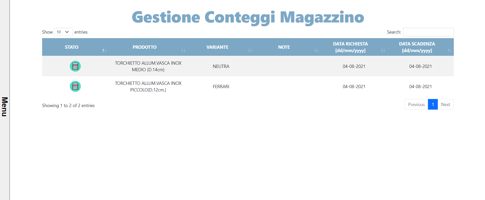
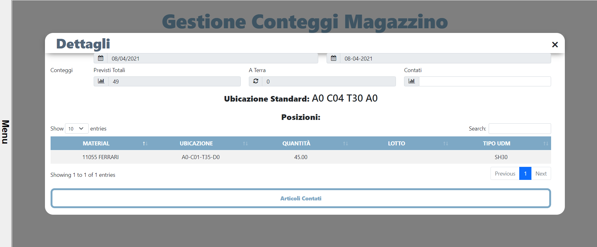
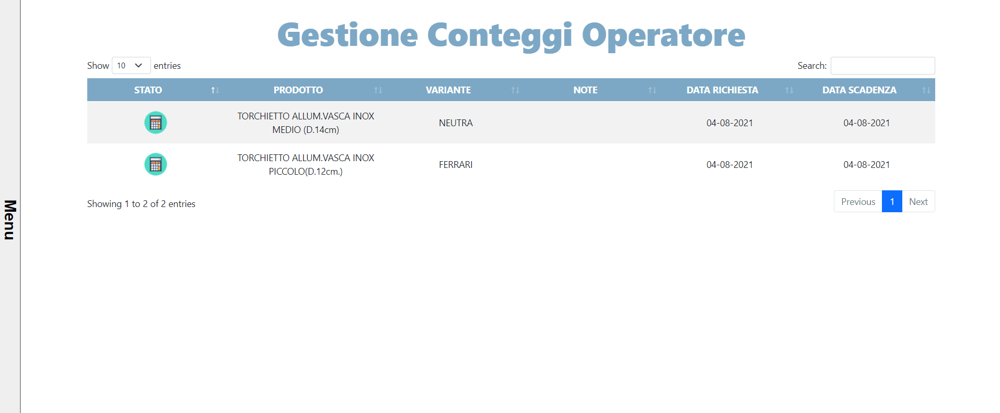
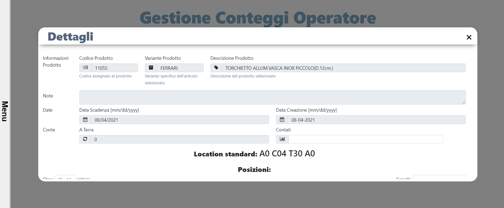
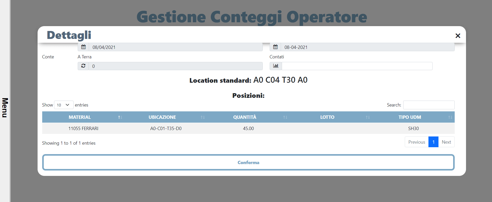

# Warehouse Request Product Count

#### A software to request the count of a specified product in warehouse

#### Check the Changelogs.md file in the doc folder to have a full walkthrough with images of the whole steps to create that application!

_Office Homepage_ 
 
_Menu_ 
 
_Filter to show closed requests_ 
 
_Autocomple search_ 
 
_Flavour selection_ 
 

---

_Warehouse Director Homepage_ 
 
_Director popup_ 
 
_Dynamic product locations_ 
 

---

_Warehouse Operator Homepage_ 
 
_Operator popup_ 
 
_Dynamic product locations_ 
 
