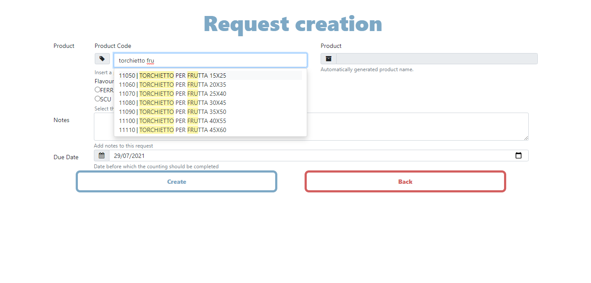
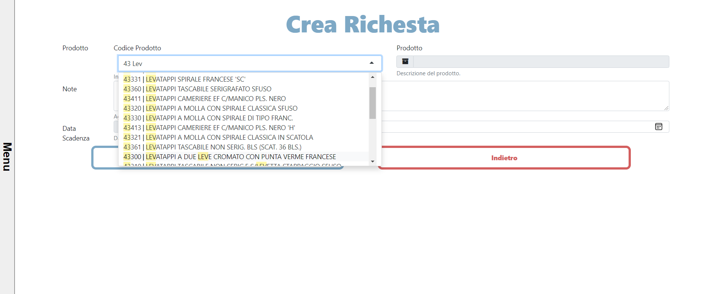

## 1. [Project setup]

#### - Created database connection

#### - Applied bootstrap template

#### - Created the basic structure of the table

#### - Added jQuery bindings

_image of project setup_ 
 
_structured file_ 
 

---

## 2. [UI Design]

#### - Created style of each page

#### - Preview photos can be found in doc/UI

_Office view_ 
 
_Warehouse view - Director_ 
 
_Warehouse view - Operator_ 
 

---

## 3. [Project structure]

#### - Created each page very basically and linked them to each css resource

#### - Fixed error in Changelog.md

_Project structure_ 
 

---

## 4. [Backend data visualization + Change in database entries names + Changes in Changelog.md]

#### - Created each table in each page and added data retrieval processes

#### - Cleaned up some code and fixed some typos

#### - Changed lastCount, newCount in DB into respectively previousCount, lastCount

#### - Added dividers in Changelog.md

_Office homepage_ 
 
_Office update_ 
 
_Warehouse homepage director_ 
 
_Warehouse update director_ 
 
_Warehouse homepage operator_ 
 
 
_Warehouse update operator_ 

## 5. [Getting ready to create the API]

#### - Moved src folder in client folder

#### - Created API folder

#### - Renamed diagrams

_Getting ready to create the API_ 
 

## 6. [API designed + Example script]

#### - Designed API and created example script

_Whole System + Example_ 
 
_Send request_ 
 
_Whole API_ 
 
_Result retrieval_ 
 
_Example_ 
 

## 6.1 [API designed + Example script] UPDATED

#### - Added type field into db_name.db.json

## 7. [Working API]

#### - Fixed a little bug and then the API worked with a test query

_Working API_ 
 

## 8. [First use of API from client]

#### - Fixed some bugs

#### - Added real time updates

#### - Linked API to client

_First use of API from client_ 
 

## 9. [Worked on API]

#### - Added possibility to use queries with variables from API

#### - Added error handlers

## 10. [Created icons]

#### - Created icons for requestState

_Icons in Inkscape_ 
 

## 11. [Website styled]

#### - Created style for website

#### - Still working on double-click popup form for requestDetails

_Website style 1/2_ 
 
_Website style 2/2_ 
 

## 12. [Popup created and styled]

#### - Completely finished to style the popup

_Popup created and styled_ 
 
_Popup created and styled_ 
 

## 13. [Finished UI Warehouse + Office]

#### - Completely finished to style the popup

_Office 1/3_ 
 
_Office 2/3_ 
 
_Office 3/3_ 
 
_Warehouse director 1/2_ 
 
_Warehouse director 2/2_ 
 
_Warehouse operator 1/2_ 
 
_Warehouse operator 2/2_ 
 

## 14. [CHECKPOINT: Fixed Bugs + Added Many Features]

#### - Fixed a lot of bugs

#### - Fixed API bugs

#### - Fixed styling

#### - Added functionalities like product locations and product search + table filters

_Added search input_ 
 
_CHECKPOINT: Fixed Bugs + Added Product Locations_ 
 

## 15. [CHECKPOINT: Finished application + Fixed Bugs]

#### - Fixed bugs of imports (removed CDNs)

#### - Translated some English text in Italian

#### - Fixed styling

#### - Added functionalities like previousExpectedCount

_Office Homepage_ 
 
_Menu_ 
 
_Filter to show closed requests_ 
 
_Autocomple search_ 
 
_Flavour selection_ 
 

---

_Warehouse Director Homepage_ 
 
_Director popup_ 
 
_Dynamic product locations_ 
 

---

_Warehouse Operator Homepage_ 
 
_Operator popup_ 
 
_Dynamic product locations_ 
 
