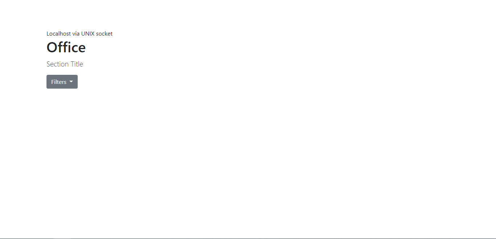

## 1. [Project setup]

####- Created database connection
####- Applied bootstrap template
####- Created the basic structure of the table
####- Added jQuery bindings
 
_image of project setup_  
 
_structured file_  

---

## 2. [UI Design]

####- Created style of each page
####- Preview photos can be found in doc/UI
 
_Office view_  
 
_Warehouse view - Director_  
 
_Warehouse view - Operator_  

---

## 3. [Project structure]

####- Created each page very basically and linked them to each css resource
####- Fixed error in Changelog.md
 
_Project structure_  

---

## 4. [Backend data visualization + Change in database entries names + Changes in Changelog.md]

####- Created each table in each page and added data retrieval processes
####- Cleaned up some code and fixed some typos
####- Changed lastCount, newCount in DB into respectively previousCount, lastCount
####- Added dividers in Changelog.md
 
_Office homepage_  
 
_Office update_  
 
_Warehouse homepage director_  
 
_Warehouse update director_  
 
_Warehouse homepage operator_  
 
_Warehouse update operator_  
