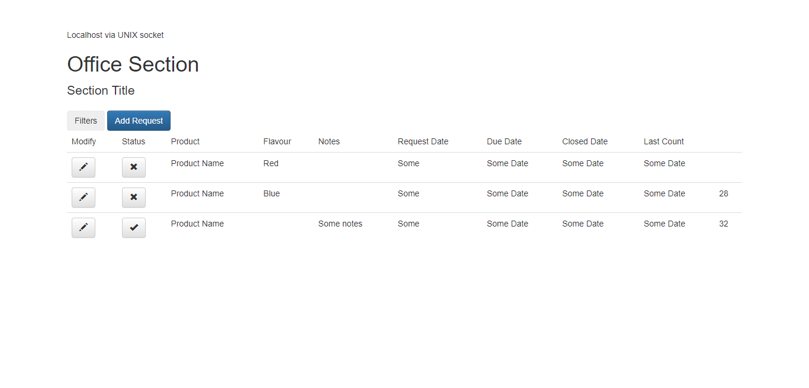

## 1. [Project setup]

####- Created database connection
####- Applied bootstrap template
####- Created the basic structure of the table
####- Added jQuery bindings
 
_image of project setup_ 
 
_structured file_ 

## 2. [UI Design]

####- Created style of each page
####- Preview photos can be found in doc/UI
 
_Office view_ 
 
_Warehouse view - Director_ 
 
_Warehouse view - Operator_ 
